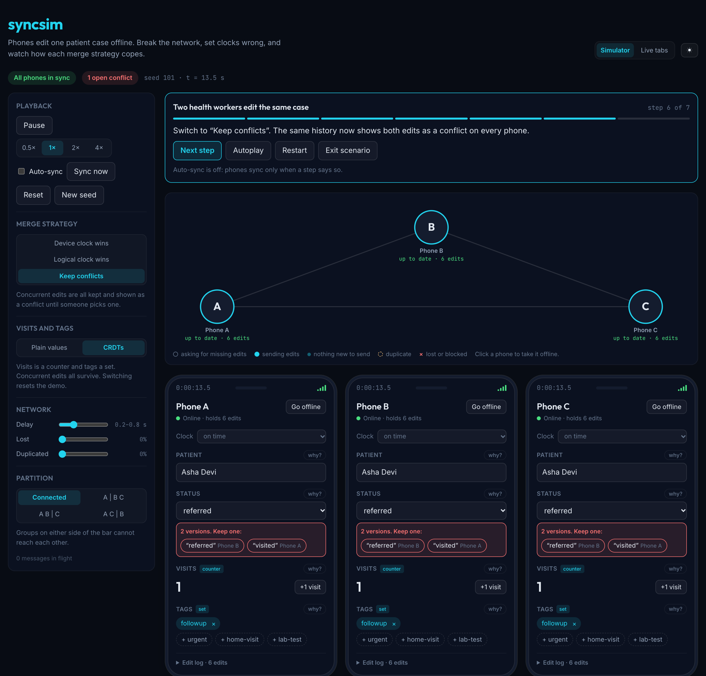

# syncsim

**An offline-first sync engine, and a playground where you can break it.**

Three phones edit the same patient case while offline. When they reconnect,
their changes have to merge without anyone's work silently disappearing.
syncsim implements that merge several ways and lets you watch each one hold up,
or fail, under a hostile network: delayed, dropped, duplicated and reordered
messages, partitions, and clocks that lie.

**[▶ Open the live demo](https://hemant10yadav.github.io/syncsim/)** ·
[How it works](docs/APPROACH.md) ·
[Build journal](docs/JOURNAL.md)

[](https://github.com/hemant10yadav/syncsim/actions/workflows/ci.yml)



## What it shows

- **Last-write-wins quietly loses work.** Take a phone offline, change the
  status on two phones, reconnect: one edit wins and the other is gone. The
  "why?" panel on the field marks the lost edit in red and explains who
  overwrote it without ever seeing it.
- **Wrong clocks make it worse.** Set a phone's clock an hour fast and, under
  "device clock wins", its old edits beat newer ones. Hybrid logical clocks fix
  the ordering; they still cannot decide truly simultaneous edits fairly.
- **The alternatives have costs too.** "Keep conflicts" never loses an edit,
  but a person has to pick one. CRDT counters and sets merge automatically, so
  two offline visits count as two, not one.

## Try it

Open the [live demo](https://hemant10yadav.github.io/syncsim/). On a first
visit a short tour plays by itself. After that:

- **Guided scenarios** walk through one story step by step, with a caption per
  step: *Two health workers edit the same case*, *The clock liar*, *Offline
  visits get lost*, *Counters keep every visit*, *Duplicate delivery*.
- **Break things yourself.** Click a phone in the network view to take it
  offline, split the phones into partitions, drag the delay, loss and
  duplication sliders, or set a phone's clock an hour wrong.
- **Compare the rules.** The "Same edits, three rules" table shows the current
  history under all three merge strategies at once, and how many edits each
  one silently loses. Click a row to switch.
- **Look inside.** Every field has a "why?" panel listing each edit and what
  became of it. Every phone has an edit log with its version vector.
- **Live tabs.** Switch to *Live tabs* and open the page in a second tab. Each
  tab is a real device; they sync through the browser's BroadcastChannel with
  the same protocol as the simulator. Nothing leaves your browser.

Every run comes from a seed kept in the URL (`?seed=42`), so any run can be
shared and replayed exactly.

## How it works

Every edit becomes an operation with a unique id, kept in each device's log.
Values are never stored directly: they are worked out from the log by the
field's merge rule, so switching strategies re-reads the same history.

1. **Clocks.** Each device stamps edits with a hybrid logical clock, which never
   runs backwards and always moves past anything the device has received.
2. **Sync.** A device sends its version vector ("I have A's edits 1 to 5, B's 1
   to 3"); the peer replies with whatever is missing. Lost messages are asked
   for again next round, duplicates are dropped by id, and order does not
   matter because every merge rule is order-independent.
3. **Merge.** Plain values use one of three strategies: device clock wins,
   logical clock wins, or keep conflicts, where each write records exactly which
   values it replaced. Counters are PN-counters and tags are observed-remove
   sets.
4. **Simulation.** Devices talk through a simulated network in virtual time.
   Every random choice (latency, loss, duplication) comes from one seed, so a
   run replays exactly.

[docs/APPROACH.md](docs/APPROACH.md) covers the design in full, including why
each write lists what it replaced instead of relying on plain vector clocks,
and ten ways this design would break in production.

## How it is tested

- **86 tests** across the engine (67) and the playground (19), run in CI on
  every pull request alongside lint, typecheck and a production build.
- **Property tests** (fast-check) play hundreds of random histories: edits,
  counters, sets, partitions, offline devices, strategy switches, clock skew up
  to an hour, and up to 30% message loss and duplication. Afterwards every
  device must hold identical data and identical conflicts, and every counter
  must equal the sum of all increments ever made.
- **Mutation checks.** Each property test was confirmed to catch a bug planted
  on purpose.
- **Scenario tests** play every guided scenario without the UI and check that
  its captions are true after each step.
- **Browser checks.** Before each merge, a Playwright script played every
  scenario and recipe in Chrome, synced two real tabs, and checked outcomes,
  console errors and layout at phone width. It is not yet part of CI.

## Project layout

| Path | What it is |
|---|---|
| `packages/engine` | The sync engine: clocks, operation log, replicas, merge strategies, CRDTs, simulated network. No UI code. |
| `apps/playground` | The React app: simulator, guided scenarios, network view, live tabs. Deployed to GitHub Pages. |
| `docs` | Design write-up, plan and build journal. |

## Run it locally

Requires Node 24.

```bash
npm install
npm run dev        # playground at http://localhost:5173/syncsim/
npm test           # engine and playground tests
npm run lint       # oxlint across the repo
npm run typecheck  # every workspace
npm run build      # production build of the playground
```

Pushing to `main` deploys the playground to GitHub Pages.

## Tech

TypeScript throughout. React 19 and Vite for the playground, vitest and
fast-check for tests, oxlint for linting, GitHub Actions for CI and deploys. The
merge logic is hand-written, with no CRDT library: understanding the merge is
the point.

---

Built by [Hemant Singh Yadav](https://hemant10yadav.github.io).
